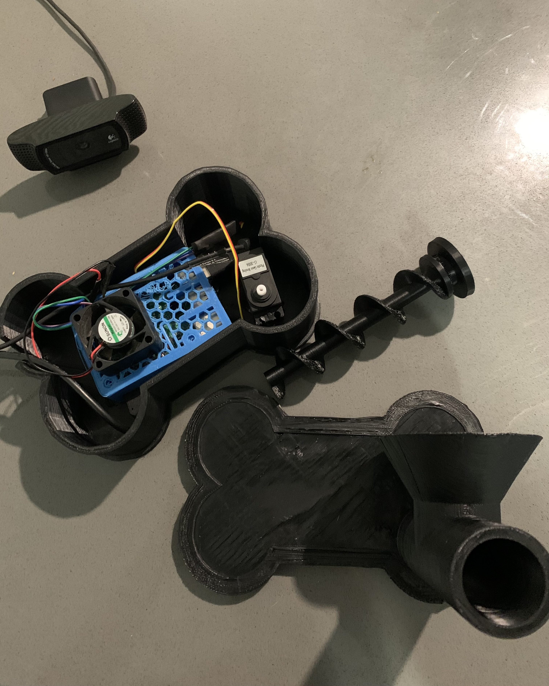

# OpenTreat
OpenTreat allows a user to place and automatically accept a video call between their smartphone and the OpenTreat dispenser system so they can view and interact with their pets while away from home. By pressing a button on the webapp, users can remotely drop treats to their pet via the dispenser system.

## Treat Dispenser System
### Overview
The treat dispenser system is built using a Raspberry Pi and 3D printed parts. When a user presses the button on the webapp, a Python script is executed on the Pi to turn the servo motor for a certain number of seconds. The servo motor turns the 3D printed auger and pushes the treat down the tube where it drops out the end and into the feeding bowl.

### Parts needed
* Raspberry Pi
* LS3006 servo (though any 360* servo will work)
* 3D printer
* Webcam

### Building the dispenser system
1. Download and 3D print each STL listed in the `models` folder
	1. The recommended print settings are in the Resources section below
2. Assemble the parts using super glue
3. Use the pinout diagram in the Resources section (or find one for your RPi model) to hook up the 3 servo wires to the Raspberry Pi’s GPIO pins

### Installing the servo script on your Raspberry Pi
A Python3 script takes advantage of the Raspberry Pi’s GPIO pins to send a signal to the servo motor when a user presses the treat button on the webapp. The script turns the servo for a set number of seconds to push the treat through the tube and drop it down at the end.

#### Clone the repo into a folder called OpenTreat in your Pi's home directory
```
git clone https://github.com/psycoder17/OpenTreat.git ~/OpenTreat
```

#### Install dependencies
```
cd python/
pip3 install -r requirements.txt
```

#### Manually execute the script to test that the servo/auger spins
```
python3 rotate_auger.py
```

Now that your Raspberry Pi properly dispenses treats when the Python script runs, we need to set up the webapp where the user can video chat with their pet and press a button to execute the servo spinning script.

## Video Chat App
The video chat app is built with Javascript using NodeJS, Express, and SimpleWebRTC. The webapp is hosted on Heroku and allows users to create a room where they can share their video with participants.

The webapp actually consists of two different NodeJS apps which can both be easily deployed to Heroku with a free account. The app contained in the `js/` folder is the main user-facing app where the video chatting features and treat dispensing buttons are activated. The app contained in the `signalserver/` directory is a dependency of the main app, and allows SimpleWebRTC to function correctly. The demo sandbox for SimpleWebRTC was deprecated and can no longer be used. Because of this we need to configure our own signaling server with SimpleWebRTC’s SignalMaster project.

### Deploying the signaling server on Heroku
```
heroku login

cd signalserver/
heroku create opentreat-signalmaster

git add .
git commit -m "commit message"
git push heroku master
```

You can test a successful SignalMaster setup by opening your Heroku URL in a web browser and navigating to the `/socket.io/`subdomain. 

> Example: https://opentreat-signalmaster.herokuapp.com/socket.io/  
>   
> If you see output similar to `{“code”:0,”message”:”Transport unknown”}`, your signaling server has been successfully deployed.  

### Deploying the video chat app on Heroku

Before you deploy the video chat app to Heroku's cloud, make sure you find and replace all instances of `https://opentreat-signalserver.herokuapp.com/` in the codebase with the URL to the signaling server you just set up.

```
cd js/
heroku create opentreat-videochat

git add .
git commit -m "commit message"
git push heroku master
```

If everything was successful you should see a web browser window pop up with the video chat application.

## Usage
### Automatic run on boot
Create a cronjob with `crontab -e` to run the Python script on boot that automatically creates a room on the OpenTreat app in Heroku's cloud.

```
@reboot python3 /home/pi/OpenTreat/src/python/create-room.py
```

### Manually creating a room on the Raspberry Pi
1. Open a web browser and navigate to your Heroku app’s URL
2. Allow your browser to access your webcam
3. Enter your name and the new room ID in the text fields
4. Press *Create Room* and your pet’s room will be set up for hosting

### Joining a room from your computer
1. Launch the video chat app by running `heroku open` in the `js/` directory or by browsing to the Heroku app’s URL
2. Allow your browser to access your webcam
3. Enter your name and the existing room ID in the text fields
4. Press *Join Room* and you will be connected to your pet’s room where you can view a video chat and remotely send treats

### Joining a room from your smartphone
1. Verify your device’s camera can be accessed by the web browser
	1. You may have to enable this option in the Settings app of your phone
2. Open a web browser and navigate to your Heroku app’s URL
3. Enter your name and the existing room ID in the text fields
4. Press *Join Room* and you will be connected to your pet’s room where you can view a video chat and remotely send treats

## Resources
### Links
:movie_camera: [Video demo of OpenTreat](https://youtu.be/6tzPRBlFip4) :movie_camera:

[Thingiverse: original fish feeder model](https://www.thingiverse.com/thing:301532)

[SimpleWebRTC GitHub](https://github.com/simplewebrtc/SimpleWebRTC)

[SimpleWebRTC SignalMaster GitHub](https://github.com/simplewebrtc/signalmaster)

### Recommended print settings
> Scale: 100%  
> Infill: 10%  
> Layer Height: 0.3  
> Speed: Standard  

### RPi GPIO Diagram
> Red wire - Pin 1 - 3v3 power  
> Black wire - Pin 6 - ground  
> Orange wire - Pin 11 - GPIO 17  


### Screenshots & proof-of-concept demo




