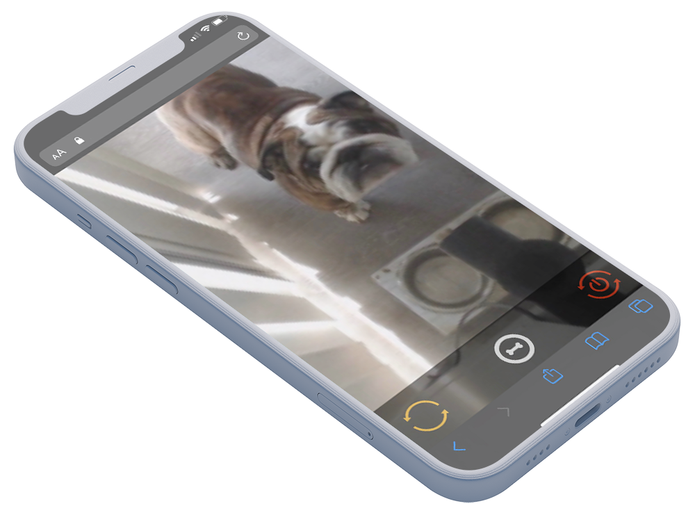

# OpenTreat
OpenTreat allows a user to view and interact with their pets while not at home. Watch a live video stream of your pets from your smartphone or laptop, and remotely dispense treats with the push of a button.

:movie_camera: [Watch video demo of OpenTreat](https://youtu.be/6tzPRBlFip4) :movie_camera:

<p align="center">
  
</p>

## Treat dispenser system
### Overview
The treat dispenser system is built using a Raspberry Pi and 3D printed parts. When a user presses the button on the webapp, a Python script is executed on the Pi to turn the servo motor for a certain number of seconds. The servo motor turns the 3D printed auger and pushes the treat down the tube where it drops out the end and into the feeding bowl.

### Parts needed
* Raspberry Pi
* LS3006 servo (any 360* servo should work)
* 3D printer
* USB webcam

### Physical assembly
1. Download and 3D print each STL listed in the `models` folder
	1. The recommended print settings are in the Resources section below
2. Assemble the parts using super glue
3. Use the pinout diagram in the Resources section (or find one for your RPi model) to hook up the 3 servo wires to the Raspberry Pi’s GPIO pins

### Find your Pi's public IP
You can get your public IP from [IPChicken](https://ipchicken.com/). Don't forget to set up port forwarding on your router.

### Register for free TURN server account
Create a free account on http://numb.viagenie.ca. You will need the server & login details you receive via email to run `populate_templates.sh`.

### Clone the repo into a folder called OpenTreat in your Pi's home directory
```
git clone https://github.com/psycoder17/OpenTreat.git ~/OpenTreat/src
cd ~/OpenTreat/src/
```

### Generate personalized files from code templates
```
bash populate_templates.sh
```

### Test the servo script on your Raspberry Pi
A Python3 script takes advantage of the Raspberry Pi’s GPIO pins to send a signal to the servo motor when a user presses the treat button on the webapp. The script turns the servo for a set number of seconds to push the treat through the tube and drop it down at the end.

### Install Python dependencies
```
pip3 install -r python/requirements.txt
```

### Manually execute the script to test that the servo/auger spins
```
python3 python/rotate_auger.py
```

Now that your Raspberry Pi properly dispenses treats when the Python script runs, Apache needs to be setup to host a PHP file that executes the Python script when the browser is redirected to `<Raspberry Pi IP>:80/spin.php`.

### Configure Apache server
```
sudo bash rpi-www/setup.sh
```

Then add `www-data ALL=(root) NOPASSWD: /sbin/reboot ` to your `/etc/sudoers` file to allow the www-data user to reboot the Pi.

The servo connected to the RPi should now spin when visiting `<Raspberry Pi IP>/spin.php` in a web browser. To add the ability to drop treats when not connected to the same WiFi network as the OpenTreat dispenser, you must port forward port 80 of the Raspberry Pi on your router's admin page.

### Configure secrets for Apache
Due to account restrictions and permission errors with the `www-data` user, we need to run the `broadcast_webcam.py` script as user `pi`. Instead of hardcoding the Pi's password into the project's source code, we can set an environment variable that reads from the file `/var/www/secrets/pipw`.

```
sudo mkdir /var/www/secrets/
sudo chown pi:root /var/www/secrets/
echo "PI_PW=<pi-user-account-password>" > /var/www/secrets/pipw
```

> Remember to replace `<pi-user-account-password>` with the password you set for `pi` when initially configuring your Raspberry Pi.

## Video stream app
The video streaming app is built with Javascript using NodeJS, Express, WebRTC, and Socket.IO. The webapp is hosted in Heroku and allows a user to login and view the video stream being broadcasted from the Pi's webcam.

### Deploy the video streaming app to Heroku
```
cd js/

heroku create <my-opentreat-project>

git add .
git commit -m "commit message"
git push heroku master
```

If everything was successful you can now browse to `https://<my-opentreat-project>.herokuapp.com/broadcast` on your Raspberry Pi to manually start broadcasting the Pi's webcam to your webapp on Heroku.

## Usage
### Automatically broadcast Pi's webcam on startup
Create a cronjob with `crontab -e` to run a Python script on boot to automatically broadcast the Pi's webcam to the webapp hosted on Heroku.

```
@reboot python3 /var/www/html/broadcast_webcam.py
```

### View the video stream
On your smartphone or laptop, browse to `https://<my-opentreat-project>.herokuapp.com` to view the video stream of your pets. 
Press the blue bone button to spin the auger and drop treats into your pets' bowl. 
The orange button restarts the webcam broadcast.
The red button reboots the Raspberry Pi.

## Resources
### Links
[Thingiverse: original fish feeder model](https://www.thingiverse.com/thing:301532)

[GitHub: original WebRTC broadcasting webapp](https://github.com/TannerGabriel/WebRTC-Video-Broadcast)

[Viagenie.ca: free TURN servers](http://numb.viagenie.ca)

### Recommended print settings
> Scale: 100%  
> Infill: 20%  
> Layer Height: 0.2  
> Speed: Standard  

### RPi GPIO diagram
> Red wire - Pin 1 - 3v3 power  
> Black wire - Pin 6 - ground  
> Orange wire - Pin 11 - GPIO 17  


### Screenshots & proof-of-concept



